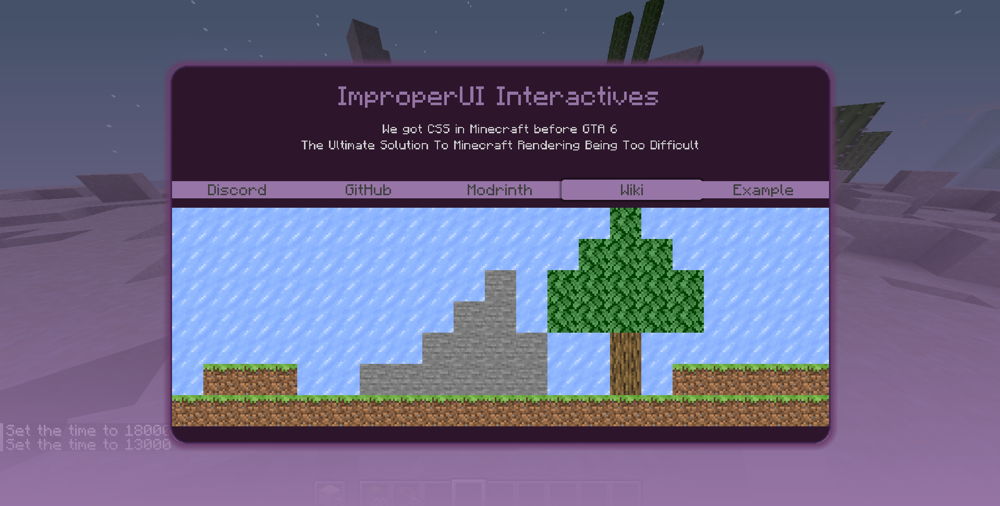

# ImproperUI
The ultimate solution to Minecraft Rendering being too hard to learn.

---

### Introduction
Unlike my other project, ClickCrystals Script, ImproperUI Script requires you to have prior knowledge of 

- Basic CSS properties and how they work
- Basic HTML structures
- Java

ImproperUI's syntax is highly inspired by CSS (Cascading Style Sheets), thought it is not entirely identical.

Below is a screenshot of an interactive screen with draggable and scrollable elements as the home page of the mod.
This screen is scripted using ImproperUI Script:



### Recent Changes
```yml
Version: 0.0.7-BETA

Added:
  - added support for collect() helper methods chain calls
  - optimized ImproperUIPanel mouse events

Patches:
  - fixed ConfigReader readFloat
  - fixed element children not updating parentPanel field
  - fixed scrolling hitboxes
  - fixed on-key element property not working
```

### Adding ImproperUI to your Project
To add ImproperUI, you download it as a jar and then add it to gradle manually.
I didn't want to create an online repository and I didn't want to make it a separate mod. Womp Womp.

[Here](https://github.com/ItziSpyder/CrosshairTarget) is an example of how ImproperUI can be used in a mod!

#### Step 1
[Download the jar](https://github.com/ItziSpyder/ImproperUI/releases/latest) and add it to your project files, as well as build.gradle as a dependency.
```gradle
dependencies {
    compileOnly files("libs/ImproperUI-theVersionYouWant.jar")
}
```

#### Step 2
Add the downloaded jar, as a mod, to your mods folder! You have to this use this a library!

#### Step 3 (Final Step)
Initialize the API. In this section, you call the init() function on ImproperUIAPI, then
provide:
- the `modId` your YOUR mod
- the `main class mod initializer` of YOUR mod
- then finally a list of script paths inside the `src/main/resources/` folder of YOUR mod.
- by convention, you should create your scripts inside of `src/main/resources/assets/YOURMODID/improperui/` folder

```java
public class ImproperUI implements ModInitializer {

    @Override
    public void onInitialize() {
        ImproperUIAPI.init("improperui", ImproperUI.class,
                "assets/improperui/improperui/what.ui",
                "assets/improperui/improperui/screen.ui"
        );
    }
}
```
```java
public class YourModInitializer implements ModInitializer {

    @Override
    public void onInitialize() {
        ImproperUIAPI.init("yourModId", YourModInitializer.class,
                "assets/yourModId/improperui/yourscreen1.ui",
                "assets/yourModId/improperui/yourscreen2.ui"
        );
    }
}
```
**DO NOTE THAT WHEN YOU ACTUALY TRY TO PARSE OR RUN THE SCRIPTS, YOU REFERENCE THE SCRIPT FILE'S NAME NOT THE PATH DECLARED HERE!**

<br>

### Events
To listen to events declared from your script, create a new class that implements `CallbackListener`.

Create a method that 

1. Has annotation `CallbackHandler`
2. Has parameter that contains the type of event you want to listen for
3. The name of the method should match the declared event from your script

```java
public class CustomCallbacks implements CallbackListener {
    
    @CallbackHandler
    public void sendHelloWorld(MouseEvent e) {
        if (e.input.isDown())
            ChatUtils.sendMessage("Hello World");
    }
}
```

In your script, the event should look like this:

```
element {
    on-click: sendHelloWorld
}
```

Finally, when you declare a `ImproperUIPanel` screen, register the callback to your panel:

```java
public void openScreen() {
    ImproperUIPanel panel = new ImproperUIPanel();
    panel.registerCallback(new CustomCallback());
    // parse script and add children elements here
    // panel.addChild()
    panel.open();
}
```

If you are running a script, provide your custom callback in the creation arguments:

```java
public void openScreen() {
    ImproperUIAPI.parseAndRunFile("yourModId", "testing.ui", new CustomCallback() /* and more... */);
}
```

<br>

### Helper Methods
```yml
Helper Methods:
  - ImproperUIPanel.collect() // a list of all elements and widgets, even their children
  - ImproperUIPanel.collectOrdered() // a sorted list based on z-index, of all elements and widgets including their children
  - ImproperUIPanel.collectById() // a list of elements with specified ID
  - ImproperUIPanel.collectByClassAttribute() // a list of elements with specified class attribute
  - ImproperUIPanel.collectFirstById() // first element with specified ID
  - ImproperUIPanel.collectFirstByClassAttribute() // first element with specified class attribute

API:
  - ImproperUIAPI.parse() // parses a script then returns all parsed result elements
  - ImproperUIAPI.parseAndRunFile() // parses a registered script file NAME (NOT PATH) from init() and opens the screen with the elements 
  - ImproperUIAPI.parseAndRunScript() // parses a registered script from init() and opens the screen with the elements
  - ImproperUIAPI.reload() // reloads the API
```

<br>

### Config Keys
A config key consists of three parts: `modId, confileFile, propertyName`. They are used for
saving configuration values for, let's say, your sliders and checkboxes. 

To use a config key in your script, simply type out all three parts **WITH NO SPACES AND SEPARATED BY A COLON (:)**.
Then use that string as an attribute class for the element:

```txt
slider #someId -yourModId:config.properties:testing-slider-value -someAnotherAttributeClass {
    
}
```
This creates a slider that sets and saves values do the config.

<br>

### Tags
| Element Tag  | Dynamic Hover, Select, Focus | Children Support | Config Support | Aliases   | Specific Properties: type                                                     |
|--------------|------------------------------|------------------|----------------|-----------|-------------------------------------------------------------------------------|
| element      | ✅                            | ✅                | ✅              | e, div    |                                                                               |
| checkbox     | ✅                            | ❌                | ✅              |           | active:boolean                                                                |
| radio        | ✅                            | ❌                | ✅              |           | active:boolean                                                                |
| button       | ✅                            | ❌                | ❌              |           |                                                                               |
| link         | ✅                            | ❌                | ❌              | a         | href:string                                                                   |
| slider       | ❌                            | ❌                | ✅              |           | min:double max:double value:double range:double,double decimal-places:integer |
| input        | ❌                            | ❌                | ✅              | textbox   | pattern:quote placeholder:quote                                               |
| textfield    | ❌                            | ❌                | ✅              | textarea  |                                                                               |
| label        | ✅                            | ❌                | ❌              | textlabel |                                                                               |
| header1      | ✅                            | ❌                | ❌              | h1        |                                                                               |
| header2      | ✅                            | ❌                | ❌              | h2        |                                                                               |
| header3      | ✅                            | ❌                | ❌              | h3        |                                                                               |
| header4      | ✅                            | ❌                | ❌              | h4        |                                                                               |
| header5      | ✅                            | ❌                | ❌              | h5        |                                                                               |
| header6      | ✅                            | ❌                | ❌              | h6        |                                                                               |
| positionable | ✅                            | ✅                | ✅              |           |                                                                               |


<br>

### This Project is Never Complete
So pull request your ideas!
Star us to receive latest interesting updates/pull requests!

<br>
<br>
<br>
<br>
<br>

Liked the home screen? This is the script!
```
div #background-gradient {
    size: 100%
    margin-top: 100%
    shadow-distance: 50%
    shadow-color: #9775a6
}

div #display {
    size: 420 240
    center: both
    border-radius: 10
    border-thickness: 1
    border-color: #412752
    background-color: #2d162c
    shadow-distance: 5
    shadow-color: #683a68

    child-align: grid
    grid-columns: 1

    div #title {
        inner-text: "ImproperUI Interactives"
        size: 100% 10
        text-align: center
        text-scale: 1.69
        text-color: #9775a6
        background-color: none
        margin-top: 15
    }

    div #motto {
        inner-text: "We got CSS in Minecraft before GTA 6"
        size: 100% 10
        text-align: center
        text-scale: 0.8
        background-color: none
        margin-top: 10
    }
    div #motto {
        inner-text: "The Ultimate Solution To Minecraft Rendering Being Too Difficult"
        size: 100% 10
        text-align: center
        text-scale: 0.8
        background-color: none
        margin-bottom: 10
    }

    div #navbar {
        size: 100% 15
        margin-top: 10
        background-color: none

        child-align: grid
        grid-columns: 100

        button #discord {
            inner-text: "Discord"
            background-color: #9775a6
            border-radius: 0
            margin: 0
            width: 20%
            padding-left: 0
            padding-right: 0

            on-click: openDiscord

            hovered => { padding: 3; border-thickness: 0; border-radius: 2; shadow-distance: 2; }
        }
        button #github {
            inner-text: "GitHub"
            background-color: #9775a6
            border-radius: 0
            margin: 0
            width: 20%
            padding-left: 0
            padding-right: 0

            on-click: openGithub

            hovered => { padding: 3; border-thickness: 0; border-radius: 2; shadow-distance: 2; }
        }
        button #modrinth {
            inner-text: "Modrinth"
            background-color: #9775a6
            border-radius: 0
            margin: 0
            width: 20%
            padding-left: 0
            padding-right: 0

            on-click: openModrinth

            hovered => { padding: 3; border-thickness: 0; border-radius: 2; shadow-distance: 2; }
        }
        button #wiki {
            inner-text: "Wiki"
            background-color: #9775a6
            border-radius: 0
            margin: 0
            width: 20%
            padding-left: 0
            padding-right: 0

            on-click: openWiki

            hovered => { padding: 3; border-thickness: 0; border-radius: 2; shadow-distance: 2; }
        }
        button #wiki {
            inner-text: "Example"
            background-color: #9775a6
            border-radius: 0
            margin: 0
            width: 20%
            padding-left: 0
            padding-right: 0

            on-click: openExampleScreen

            hovered => { padding: 3; border-thickness: 0; border-radius: 2; shadow-distance: 2; }
        }
    }

    div #mini-world {
        size: 100% 140
        background-color: none

        child-align: grid
        grid-columns: 21

        scrollable: true
        background-clip: padding

        div #block { background-image: textures/block/ice.png; size: 20; draggable: true; hovered => { border-thickness: 1; border-color: white; } }
        div #block { background-image: textures/block/ice.png; size: 20; draggable: true; hovered => { border-thickness: 1; border-color: white; } }
        div #block { background-image: textures/block/ice.png; size: 20; draggable: true; hovered => { border-thickness: 1; border-color: white; } }
        div #block { background-image: textures/block/ice.png; size: 20; draggable: true; hovered => { border-thickness: 1; border-color: white; } }
        div #block { background-image: textures/block/ice.png; size: 20; draggable: true; hovered => { border-thickness: 1; border-color: white; } }
        div #block { background-image: textures/block/ice.png; size: 20; draggable: true; hovered => { border-thickness: 1; border-color: white; } }
        div #block { background-image: textures/block/ice.png; size: 20; draggable: true; hovered => { border-thickness: 1; border-color: white; } }
        div #block { background-image: textures/block/ice.png; size: 20; draggable: true; hovered => { border-thickness: 1; border-color: white; } }
        div #block { background-image: textures/block/ice.png; size: 20; draggable: true; hovered => { border-thickness: 1; border-color: white; } }
        div #block { background-image: textures/block/ice.png; size: 20; draggable: true; hovered => { border-thickness: 1; border-color: white; } }
        div #block { background-image: textures/block/ice.png; size: 20; draggable: true; hovered => { border-thickness: 1; border-color: white; } }
        div #block { background-image: textures/block/ice.png; size: 20; draggable: true; hovered => { border-thickness: 1; border-color: white; } }
        div #block { background-image: textures/block/ice.png; size: 20; draggable: true; hovered => { border-thickness: 1; border-color: white; } }
        div #block { background-image: textures/block/ice.png; size: 20; draggable: true; hovered => { border-thickness: 1; border-color: white; } }
        div #block { background-image: textures/block/oak_leaves.png; size: 20; draggable: true; hovered => { border-thickness: 1; border-color: white; } div #greenshade { size: 100%; background-color: green; opacity: 0.5; click-through: true; } }
        div #block { background-image: textures/block/ice.png; size: 20; draggable: true; hovered => { border-thickness: 1; border-color: white; } }
        div #block { background-image: textures/block/ice.png; size: 20; draggable: true; hovered => { border-thickness: 1; border-color: white; } }
        div #block { background-image: textures/block/ice.png; size: 20; draggable: true; hovered => { border-thickness: 1; border-color: white; } }
        div #block { background-image: textures/block/ice.png; size: 20; draggable: true; hovered => { border-thickness: 1; border-color: white; } }
        div #block { background-image: textures/block/ice.png; size: 20; draggable: true; hovered => { border-thickness: 1; border-color: white; } }
        div #block { background-image: textures/block/ice.png; size: 20; draggable: true; hovered => { border-thickness: 1; border-color: white; } }

        div #block { background-image: textures/block/ice.png; size: 20; draggable: true; hovered => { border-thickness: 1; border-color: white; } }
        div #block { background-image: textures/block/ice.png; size: 20; draggable: true; hovered => { border-thickness: 1; border-color: white; } }
        div #block { background-image: textures/block/ice.png; size: 20; draggable: true; hovered => { border-thickness: 1; border-color: white; } }
        div #block { background-image: textures/block/ice.png; size: 20; draggable: true; hovered => { border-thickness: 1; border-color: white; } }
        div #block { background-image: textures/block/ice.png; size: 20; draggable: true; hovered => { border-thickness: 1; border-color: white; } }
        div #block { background-image: textures/block/ice.png; size: 20; draggable: true; hovered => { border-thickness: 1; border-color: white; } }
        div #block { background-image: textures/block/ice.png; size: 20; draggable: true; hovered => { border-thickness: 1; border-color: white; } }
        div #block { background-image: textures/block/ice.png; size: 20; draggable: true; hovered => { border-thickness: 1; border-color: white; } }
        div #block { background-image: textures/block/ice.png; size: 20; draggable: true; hovered => { border-thickness: 1; border-color: white; } }
        div #block { background-image: textures/block/ice.png; size: 20; draggable: true; hovered => { border-thickness: 1; border-color: white; } }
        div #block { background-image: textures/block/ice.png; size: 20; draggable: true; hovered => { border-thickness: 1; border-color: white; } }
        div #block { background-image: textures/block/ice.png; size: 20; draggable: true; hovered => { border-thickness: 1; border-color: white; } }
        div #block { background-image: textures/block/ice.png; size: 20; draggable: true; hovered => { border-thickness: 1; border-color: white; } }
        div #block { background-image: textures/block/oak_leaves.png; size: 20; draggable: true; hovered => { border-thickness: 1; border-color: white; } div #greenshade { size: 100%; background-color: green; opacity: 0.5; click-through: true; } }
        div #block { background-image: textures/block/oak_leaves.png; size: 20; draggable: true; hovered => { border-thickness: 1; border-color: white; } div #greenshade { size: 100%; background-color: green; opacity: 0.5; click-through: true; } }
        div #block { background-image: textures/block/oak_leaves.png; size: 20; draggable: true; hovered => { border-thickness: 1; border-color: white; } div #greenshade { size: 100%; background-color: green; opacity: 0.5; click-through: true; } }
        div #block { background-image: textures/block/ice.png; size: 20; draggable: true; hovered => { border-thickness: 1; border-color: white; } }
        div #block { background-image: textures/block/ice.png; size: 20; draggable: true; hovered => { border-thickness: 1; border-color: white; } }
        div #block { background-image: textures/block/ice.png; size: 20; draggable: true; hovered => { border-thickness: 1; border-color: white; } }
        div #block { background-image: textures/block/ice.png; size: 20; draggable: true; hovered => { border-thickness: 1; border-color: white; } }
        div #block { background-image: textures/block/ice.png; size: 20; draggable: true; hovered => { border-thickness: 1; border-color: white; } }

        div #block { background-image: textures/block/ice.png; size: 20; draggable: true; hovered => { border-thickness: 1; border-color: white; } }
        div #block { background-image: textures/block/ice.png; size: 20; draggable: true; hovered => { border-thickness: 1; border-color: white; } }
        div #block { background-image: textures/block/ice.png; size: 20; draggable: true; hovered => { border-thickness: 1; border-color: white; } }
        div #block { background-image: textures/block/ice.png; size: 20; draggable: true; hovered => { border-thickness: 1; border-color: white; } }
        div #block { background-image: textures/block/ice.png; size: 20; draggable: true; hovered => { border-thickness: 1; border-color: white; } }
        div #block { background-image: textures/block/ice.png; size: 20; draggable: true; hovered => { border-thickness: 1; border-color: white; } }
        div #block { background-image: textures/block/ice.png; size: 20; draggable: true; hovered => { border-thickness: 1; border-color: white; } }
        div #block { background-image: textures/block/ice.png; size: 20; draggable: true; hovered => { border-thickness: 1; border-color: white; } }
        div #block { background-image: textures/block/ice.png; size: 20; draggable: true; hovered => { border-thickness: 1; border-color: white; } }
        div #block { background-image: textures/block/ice.png; size: 20; draggable: true; hovered => { border-thickness: 1; border-color: white; } }
        div #block { background-image: textures/block/stone.png; size: 20; draggable: true; hovered => { border-thickness: 1; border-color: white; } }
        div #block { background-image: textures/block/ice.png; size: 20; draggable: true; hovered => { border-thickness: 1; border-color: white; } }
        div #block { background-image: textures/block/oak_leaves.png; size: 20; draggable: true; hovered => { border-thickness: 1; border-color: white; } div #greenshade { size: 100%; background-color: green; opacity: 0.5; click-through: true; } }
        div #block { background-image: textures/block/oak_leaves.png; size: 20; draggable: true; hovered => { border-thickness: 1; border-color: white; } div #greenshade { size: 100%; background-color: green; opacity: 0.5; click-through: true; } }
        div #block { background-image: textures/block/oak_leaves.png; size: 20; draggable: true; hovered => { border-thickness: 1; border-color: white; } div #greenshade { size: 100%; background-color: green; opacity: 0.5; click-through: true; } }
        div #block { background-image: textures/block/oak_leaves.png; size: 20; draggable: true; hovered => { border-thickness: 1; border-color: white; } div #greenshade { size: 100%; background-color: green; opacity: 0.5; click-through: true; } }
        div #block { background-image: textures/block/oak_leaves.png; size: 20; draggable: true; hovered => { border-thickness: 1; border-color: white; } div #greenshade { size: 100%; background-color: green; opacity: 0.5; click-through: true; } }
        div #block { background-image: textures/block/ice.png; size: 20; draggable: true; hovered => { border-thickness: 1; border-color: white; } }
        div #block { background-image: textures/block/ice.png; size: 20; draggable: true; hovered => { border-thickness: 1; border-color: white; } }
        div #block { background-image: textures/block/ice.png; size: 20; draggable: true; hovered => { border-thickness: 1; border-color: white; } }
        div #block { background-image: textures/block/ice.png; size: 20; draggable: true; hovered => { border-thickness: 1; border-color: white; } }

        div #block { background-image: textures/block/ice.png; size: 20; draggable: true; hovered => { border-thickness: 1; border-color: white; } }
        div #block { background-image: textures/block/ice.png; size: 20; draggable: true; hovered => { border-thickness: 1; border-color: white; } }
        div #block { background-image: textures/block/ice.png; size: 20; draggable: true; hovered => { border-thickness: 1; border-color: white; } }
        div #block { background-image: textures/block/ice.png; size: 20; draggable: true; hovered => { border-thickness: 1; border-color: white; } }
        div #block { background-image: textures/block/ice.png; size: 20; draggable: true; hovered => { border-thickness: 1; border-color: white; } }
        div #block { background-image: textures/block/ice.png; size: 20; draggable: true; hovered => { border-thickness: 1; border-color: white; } }
        div #block { background-image: textures/block/ice.png; size: 20; draggable: true; hovered => { border-thickness: 1; border-color: white; } }
        div #block { background-image: textures/block/ice.png; size: 20; draggable: true; hovered => { border-thickness: 1; border-color: white; } }
        div #block { background-image: textures/block/ice.png; size: 20; draggable: true; hovered => { border-thickness: 1; border-color: white; } }
        div #block { background-image: textures/block/stone.png; size: 20; draggable: true; hovered => { border-thickness: 1; border-color: white; } }
        div #block { background-image: textures/block/stone.png; size: 20; draggable: true; hovered => { border-thickness: 1; border-color: white; } }
        div #block { background-image: textures/block/ice.png; size: 20; draggable: true; hovered => { border-thickness: 1; border-color: white; } }
        div #block { background-image: textures/block/oak_leaves.png; size: 20; draggable: true; hovered => { border-thickness: 1; border-color: white; } div #greenshade { size: 100%; background-color: green; opacity: 0.5; click-through: true; } }
        div #block { background-image: textures/block/oak_leaves.png; size: 20; draggable: true; hovered => { border-thickness: 1; border-color: white; } div #greenshade { size: 100%; background-color: green; opacity: 0.5; click-through: true; } }
        div #block { background-image: textures/block/oak_leaves.png; size: 20; draggable: true; hovered => { border-thickness: 1; border-color: white; } div #greenshade { size: 100%; background-color: green; opacity: 0.5; click-through: true; } }
        div #block { background-image: textures/block/oak_leaves.png; size: 20; draggable: true; hovered => { border-thickness: 1; border-color: white; } div #greenshade { size: 100%; background-color: green; opacity: 0.5; click-through: true; } }
        div #block { background-image: textures/block/oak_leaves.png; size: 20; draggable: true; hovered => { border-thickness: 1; border-color: white; } div #greenshade { size: 100%; background-color: green; opacity: 0.5; click-through: true; } }
        div #block { background-image: textures/block/ice.png; size: 20; draggable: true; hovered => { border-thickness: 1; border-color: white; } }
        div #block { background-image: textures/block/ice.png; size: 20; draggable: true; hovered => { border-thickness: 1; border-color: white; } }
        div #block { background-image: textures/block/ice.png; size: 20; draggable: true; hovered => { border-thickness: 1; border-color: white; } }
        div #block { background-image: textures/block/ice.png; size: 20; draggable: true; hovered => { border-thickness: 1; border-color: white; } }

        div #block { background-image: textures/block/ice.png; size: 20; draggable: true; hovered => { border-thickness: 1; border-color: white; } }
        div #block { background-image: textures/block/ice.png; size: 20; draggable: true; hovered => { border-thickness: 1; border-color: white; } }
        div #block { background-image: textures/block/ice.png; size: 20; draggable: true; hovered => { border-thickness: 1; border-color: white; } }
        div #block { background-image: textures/block/ice.png; size: 20; draggable: true; hovered => { border-thickness: 1; border-color: white; } }
        div #block { background-image: textures/block/ice.png; size: 20; draggable: true; hovered => { border-thickness: 1; border-color: white; } }
        div #block { background-image: textures/block/ice.png; size: 20; draggable: true; hovered => { border-thickness: 1; border-color: white; } }
        div #block { background-image: textures/block/ice.png; size: 20; draggable: true; hovered => { border-thickness: 1; border-color: white; } }
        div #block { background-image: textures/block/ice.png; size: 20; draggable: true; hovered => { border-thickness: 1; border-color: white; } }
        div #block { background-image: textures/block/stone.png; size: 20; draggable: true; hovered => { border-thickness: 1; border-color: white; } }
        div #block { background-image: textures/block/stone.png; size: 20; draggable: true; hovered => { border-thickness: 1; border-color: white; } }
        div #block { background-image: textures/block/stone.png; size: 20; draggable: true; hovered => { border-thickness: 1; border-color: white; } }
        div #block { background-image: textures/block/stone.png; size: 20; draggable: true; hovered => { border-thickness: 1; border-color: white; } }
        div #block { background-image: textures/block/ice.png; size: 20; draggable: true; hovered => { border-thickness: 1; border-color: white; } }
        div #block { background-image: textures/block/ice.png; size: 20; draggable: true; hovered => { border-thickness: 1; border-color: white; } }
        div #block { background-image: textures/block/oak_log.png; size: 20; draggable: true; hovered => { border-thickness: 1; border-color: white; } }
        div #block { background-image: textures/block/ice.png; size: 20; draggable: true; hovered => { border-thickness: 1; border-color: white; } }
        div #block { background-image: textures/block/ice.png; size: 20; draggable: true; hovered => { border-thickness: 1; border-color: white; } }
        div #block { background-image: textures/block/ice.png; size: 20; draggable: true; hovered => { border-thickness: 1; border-color: white; } }
        div #block { background-image: textures/block/ice.png; size: 20; draggable: true; hovered => { border-thickness: 1; border-color: white; } }
        div #block { background-image: textures/block/ice.png; size: 20; draggable: true; hovered => { border-thickness: 1; border-color: white; } }
        div #block { background-image: textures/block/ice.png; size: 20; draggable: true; hovered => { border-thickness: 1; border-color: white; } }

        div #block { background-image: textures/block/ice.png; size: 20; draggable: true; hovered => { border-thickness: 1; border-color: white; } }
        div #block { background-image: textures/block/grass_block_side.png; size: 20; draggable: true; hovered => { border-thickness: 1; border-color: white; } }
        div #block { background-image: textures/block/grass_block_side.png; size: 20; draggable: true; hovered => { border-thickness: 1; border-color: white; } }
        div #block { background-image: textures/block/grass_block_side.png; size: 20; draggable: true; hovered => { border-thickness: 1; border-color: white; } }
        div #block { background-image: textures/block/ice.png; size: 20; draggable: true; hovered => { border-thickness: 1; border-color: white; } }
        div #block { background-image: textures/block/ice.png; size: 20; draggable: true; hovered => { border-thickness: 1; border-color: white; } }
        div #block { background-image: textures/block/stone.png; size: 20; draggable: true; hovered => { border-thickness: 1; border-color: white; } }
        div #block { background-image: textures/block/stone.png; size: 20; draggable: true; hovered => { border-thickness: 1; border-color: white; } }
        div #block { background-image: textures/block/stone.png; size: 20; draggable: true; hovered => { border-thickness: 1; border-color: white; } }
        div #block { background-image: textures/block/stone.png; size: 20; draggable: true; hovered => { border-thickness: 1; border-color: white; } }
        div #block { background-image: textures/block/stone.png; size: 20; draggable: true; hovered => { border-thickness: 1; border-color: white; } }
        div #block { background-image: textures/block/stone.png; size: 20; draggable: true; hovered => { border-thickness: 1; border-color: white; } }
        div #block { background-image: textures/block/ice.png; size: 20; draggable: true; hovered => { border-thickness: 1; border-color: white; } }
        div #block { background-image: textures/block/ice.png; size: 20; draggable: true; hovered => { border-thickness: 1; border-color: white; } }
        div #block { background-image: textures/block/oak_log.png; size: 20; draggable: true; hovered => { border-thickness: 1; border-color: white; } }
        div #block { background-image: textures/block/ice.png; size: 20; draggable: true; hovered => { border-thickness: 1; border-color: white; } }
        div #block { background-image: textures/block/grass_block_side.png; size: 20; draggable: true; hovered => { border-thickness: 1; border-color: white; } }
        div #block { background-image: textures/block/grass_block_side.png; size: 20; draggable: true; hovered => { border-thickness: 1; border-color: white; } }
        div #block { background-image: textures/block/grass_block_side.png; size: 20; draggable: true; hovered => { border-thickness: 1; border-color: white; } }
        div #block { background-image: textures/block/grass_block_side.png; size: 20; draggable: true; hovered => { border-thickness: 1; border-color: white; } }
        div #block { background-image: textures/block/grass_block_side.png; size: 20; draggable: true; hovered => { border-thickness: 1; border-color: white; } }

        div #block { background-image: textures/block/grass_block_side.png; size: 20; draggable: true; hovered => { border-thickness: 1; border-color: white; } }
        div #block { background-image: textures/block/grass_block_side.png; size: 20; draggable: true; hovered => { border-thickness: 1; border-color: white; } }
        div #block { background-image: textures/block/grass_block_side.png; size: 20; draggable: true; hovered => { border-thickness: 1; border-color: white; } }
        div #block { background-image: textures/block/grass_block_side.png; size: 20; draggable: true; hovered => { border-thickness: 1; border-color: white; } }
        div #block { background-image: textures/block/grass_block_side.png; size: 20; draggable: true; hovered => { border-thickness: 1; border-color: white; } }
        div #block { background-image: textures/block/grass_block_side.png; size: 20; draggable: true; hovered => { border-thickness: 1; border-color: white; } }
        div #block { background-image: textures/block/grass_block_side.png; size: 20; draggable: true; hovered => { border-thickness: 1; border-color: white; } }
        div #block { background-image: textures/block/grass_block_side.png; size: 20; draggable: true; hovered => { border-thickness: 1; border-color: white; } }
        div #block { background-image: textures/block/grass_block_side.png; size: 20; draggable: true; hovered => { border-thickness: 1; border-color: white; } }
        div #block { background-image: textures/block/grass_block_side.png; size: 20; draggable: true; hovered => { border-thickness: 1; border-color: white; } }
        div #block { background-image: textures/block/grass_block_side.png; size: 20; draggable: true; hovered => { border-thickness: 1; border-color: white; } }
        div #block { background-image: textures/block/grass_block_side.png; size: 20; draggable: true; hovered => { border-thickness: 1; border-color: white; } }
        div #block { background-image: textures/block/grass_block_side.png; size: 20; draggable: true; hovered => { border-thickness: 1; border-color: white; } }
        div #block { background-image: textures/block/grass_block_side.png; size: 20; draggable: true; hovered => { border-thickness: 1; border-color: white; } }
        div #block { background-image: textures/block/grass_block_side.png; size: 20; draggable: true; hovered => { border-thickness: 1; border-color: white; } }
        div #block { background-image: textures/block/grass_block_side.png; size: 20; draggable: true; hovered => { border-thickness: 1; border-color: white; } }
        div #block { background-image: textures/block/grass_block_side.png; size: 20; draggable: true; hovered => { border-thickness: 1; border-color: white; } }
        div #block { background-image: textures/block/grass_block_side.png; size: 20; draggable: true; hovered => { border-thickness: 1; border-color: white; } }
        div #block { background-image: textures/block/grass_block_side.png; size: 20; draggable: true; hovered => { border-thickness: 1; border-color: white; } }
        div #block { background-image: textures/block/grass_block_side.png; size: 20; draggable: true; hovered => { border-thickness: 1; border-color: white; } }
        div #block { background-image: textures/block/grass_block_side.png; size: 20; draggable: true; hovered => { border-thickness: 1; border-color: white; } }
    }
}
```
